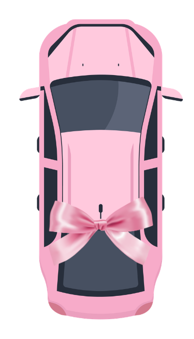
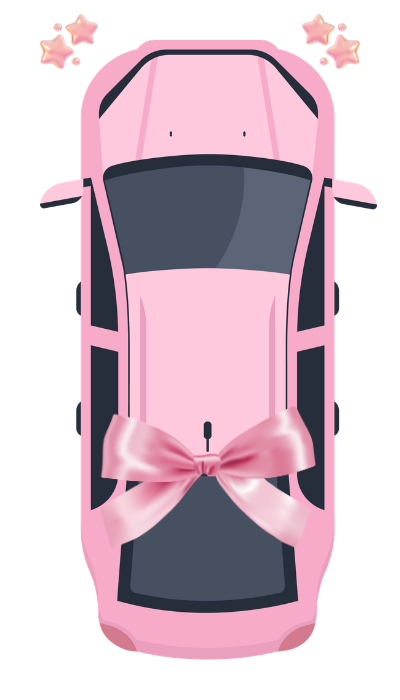
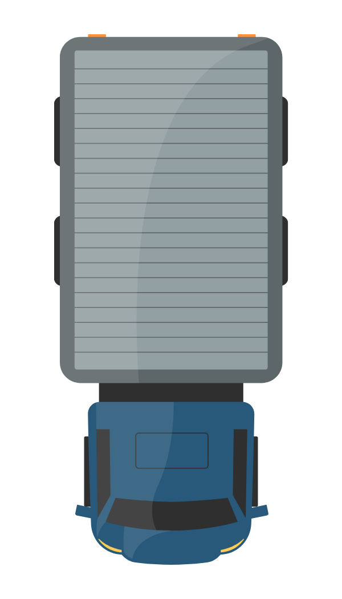
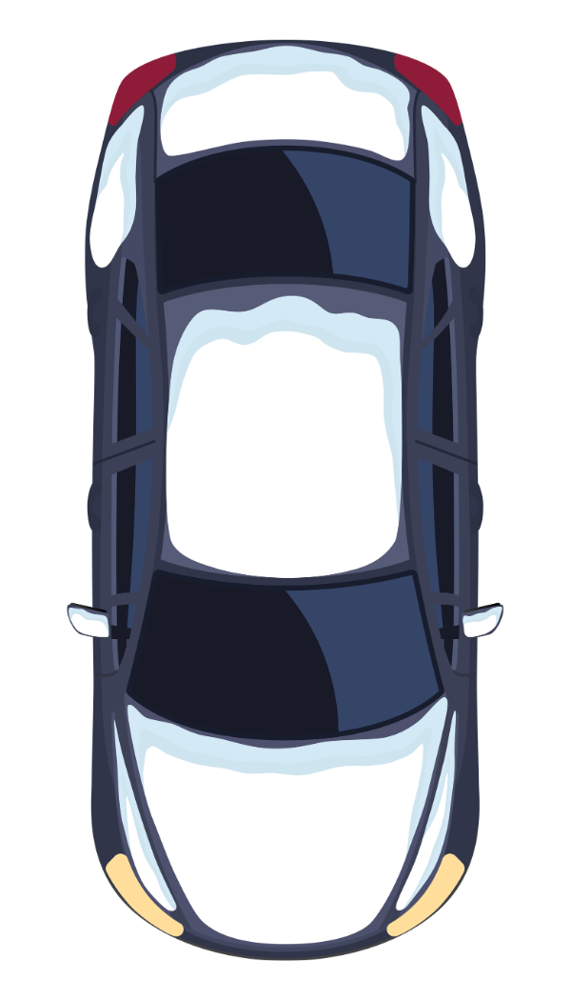
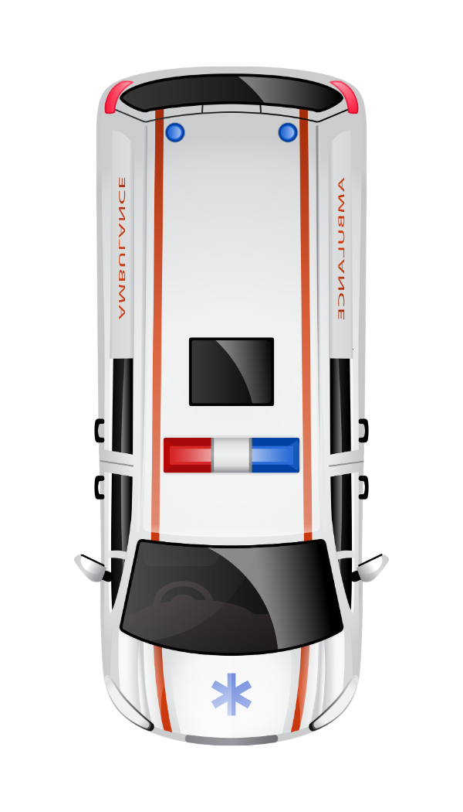
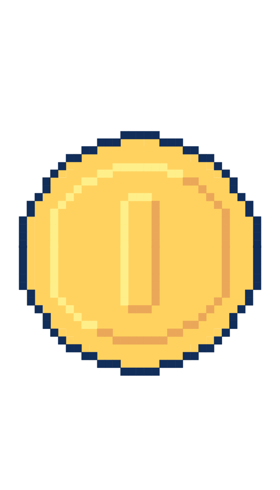
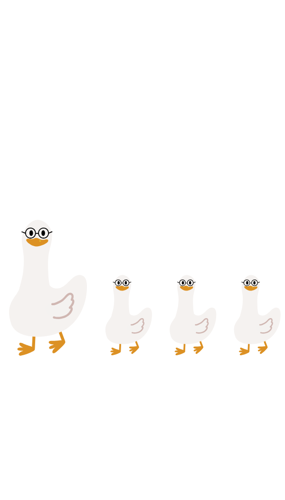
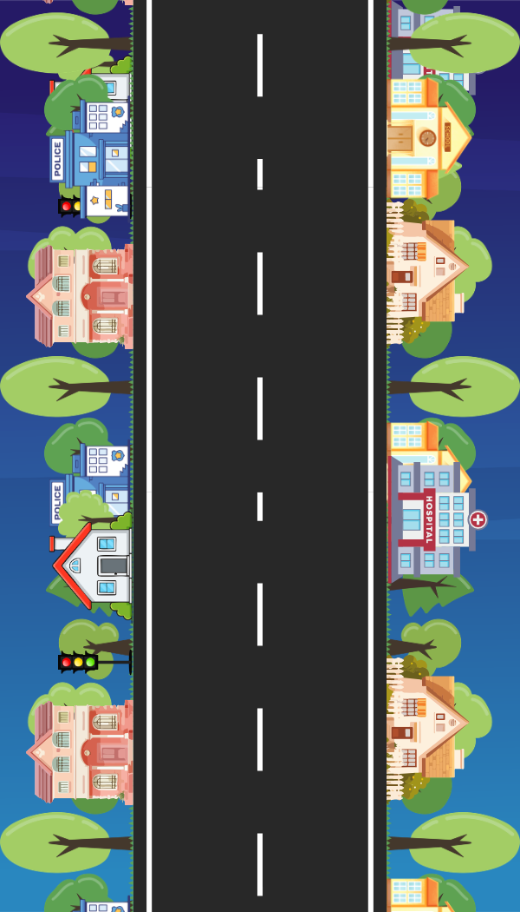

# 🏎️ Car Game Racing (Qt 6 & QML)

[](https://www.qt.io/)
[](https://cplusplus.com/)
[](https://microsoft.com/)

<p align="center">
  
</p>

Một dự án game đua xe tránh chướng ngại vật 2D hiện đại được phát triển bằng ngôn ngữ **C++** cho phần xử lý logic cốt lõi (Engine) kết hợp với **QML (Qt Quick)** cho phần giao diện mượt mà và hiệu ứng âm thanh sống động thông qua **Qt Multimedia**.

---

## 🎮 Giới thiệu & Tính năng Game

**Car Game Racing** đưa người chơi vào một đường đua vô tận, nơi bạn phải điều khiển chiếc xe của mình né tránh các chướng ngại vật đang rơi xuống ngày một nhanh, đồng thời thu thập các đồng xu trên đường đi để gia tăng điểm số và kích hoạt khiên bảo vệ.

### 🌟 Các Tính năng Chính:
- **Đồ họa tự cuộn vô tận**: Hiệu ứng cuộn nền liên tục tạo cảm giác tốc độ chân thực.
- **Hệ thống chướng ngại vật & Xu ngẫu nhiên**: Các vật cản (barriers, obstacles) và xu (coins) được sinh ra ngẫu nhiên từ phía C++ Engine.
- **Tăng tốc độ tự động**: Cứ mỗi 5 giây, tốc độ game sẽ tăng thêm để nâng cao độ khó.
- **Khiên bảo vệ (Shield)**: Khi tích lũy đủ từ **3 xu trở lên**, nhấn phím `Space` để kích hoạt khiên hộ mệnh trong **5 giây**. Xe sẽ đổi ngoại hình và trở nên bất tử trước mọi va chạm.
- **Hệ thống âm thanh đầy đủ**: Nhạc nền ngẫu nhiên xáo bài tự động, hiệu ứng âm thanh riêng biệt khi ăn xu, va chạm và kích hoạt/tắt khiên.
- **Giao diện thân thiện**: Menu mở đầu, màn hình tạm dừng (Pause) và màn hình Game Over bắt mắt.

---

## ⌨️ Điều khiển Game (Game Controls)

| Phím điều khiển | Hành động |
| :--- | :--- |
| **`Mũi tên Trái (Left Arrow)`** | Di chuyển xe sang làn bên trái (Làn 1) |
| **`Mũi tên Phải (Right Arrow)`** | Di chuyển xe sang làn bên phải (Làn 2) |
| **`Space (Phím cách)`** | Sử dụng 3 xu để kích hoạt Khiên bất tử (Shield) trong 5 giây |
| **`Chuột / Touch`** | Tương tác với các nút trên Menu, Pause và Replay |

---

## 📂 Cấu trúc Thư mục Dự án (File Structure)

Cấu trúc thư mục được thiết kế theo mô hình kết hợp chặt chẽ giữa C++ (Logic) và QML (UI):

```text
BT_KTLT/
├── assets/                  # Chứa toàn bộ hình ảnh (xe, nền, chướng ngại vật, nút...)
├── sounds/                  # Chứa nhạc nền (.wav, .mp3) và các hiệu ứng âm thanh
├── importedcontent/         # Thư mục chứa nội dung bổ sung (nếu có)
├── CMakeLists.txt           # File cấu hình xây dựng hệ thống bằng CMake
├── main.cpp                 # Điểm khởi đầu ứng dụng, liên kết C++ Engine và QML
├── Main.qml                 # File giao diện gốc (gồm âm thanh chính và điều phối màn hình)
├── MenuView.qml             # Màn hình Menu khởi động game
├── GameView.qml             # Màn hình chơi game chính (xử lý di chuyển, phím bấm, hoạt ảnh)
├── gameengine.h / .cpp      # Logic cốt lõi: xử lý điểm số, va chạm, quản lý vật thể, Timer
├── car.h / .cpp             # Định nghĩa cấu trúc và trạng thái của xe người chơi
├── obstacle.h / .cpp        # Định nghĩa các vật cản và tiền xu di chuyển trên đường đua
└── entity.h / .cpp          # Class cơ sở (Base Class) cho mọi thực thể trong game
```

---

## 🚀 Hướng dẫn xây dựng & Khởi chạy Game (Build & Run)

Vì bản đóng gói sẵn đã được gỡ bỏ, bạn cần biên dịch dự án từ mã nguồn. Dưới đây là các cách thực hiện đơn giản nhất:

### 🛠️ Cách 1: Sử dụng Qt Creator (Khuyên dùng)
Đây là cách dễ dàng nhất trên cả Windows và macOS:
1. Tải và cài đặt **[Qt Creator](https://www.qt.io/download)** (Đảm bảo đã cài đặt Qt 6.x trở lên cùng các thành phần `Qt Quick` và `Qt Multimedia`).
2. Mở Qt Creator -> Chọn **Open Project** -> Tìm và chọn tệp **`CMakeLists.txt`** ở thư mục gốc của dự án.
3. Chọn bộ Kit phù hợp (ví dụ: `Desktop Qt 6.x.x`) rồi nhấn **Configure Project**.
4. Nhấn nút **Run** (biểu tượng tam giác màu xanh lá ở góc dưới bên trái) hoặc nhấn tổ hợp phím `Ctrl + R` (`Cmd + R` trên macOS) để tự động biên dịch và chạy game.

### 💻 Cách 2: Sử dụng Dòng lệnh (Command Line với CMake)
Yêu cầu máy tính của bạn đã cài đặt CMake, bộ công cụ biên dịch (MSVC/MinGW trên Windows, Clang trên macOS) và Qt 6.

1. **Cấu hình dự án (Configure):**
   Mở Terminal/Command Prompt tại thư mục gốc của dự án và chạy:
   ```bash
   cmake -B build -S .
   ```
   *(Nếu CMake không tự tìm thấy Qt 6, bạn cần truyền thêm tham số đường dẫn cài đặt Qt: `-DCMAKE_PREFIX_PATH="ĐƯỜNG_DẪN_QT6"`)*

2. **Biên dịch dự án (Build):**
   ```bash
   cmake --build build --config Release
   ```

3. **Chạy ứng dụng (Run):**
   * **Trên Windows:**
     ```cmd
     .\build\Release\appCarGame.exe
     ```
   * **Trên macOS:**
     ```bash
     ./build/appCarGame.app/Contents/MacOS/appCarGame
     ```

---

## 🖼️ Bộ sưu tập tài nguyên Game (Game Asset Gallery)

Dưới đây là một số hình ảnh nhân vật, vật phẩm và đường đua được lấy trực tiếp từ thư mục `assets` của dự án game này (nổi bật là xe đua màu hồng đặc trưng):

### 🏎️ Xe đua người chơi (Player Cars)
| Xe đua chính (Xe màu hồng) | Xe khi kích hoạt Khiên bảo vệ |
| :---: | :---: |
|  |  |

### 🚗 Các xe cản đường (Obstacle Cars)
| Xe cản đường 1 | Xe cản đường 2 | Xe cản đường 3 |
| :---: | :---: | :---: |
|  |  |  |

### 🪙 Vật phẩm & Chướng ngại vật khác (Items & Other Obstacles)
| Đồng xu vàng | Rào chắn đường | Con ngỗng (Chướng ngại vật) |
| :---: | :---: | :---: |
|  |  |  |

### 🛣️ Đường đua vô tận (Game Road Background)
<p align="center">
  
</p>

---

## 📝 Yêu cầu Hệ thống tối thiểu
- **Hệ điều hành**: Windows 10/11 (64-bit) hoặc macOS Big Sur trở lên.
- **Môi trường (để chỉnh sửa/phát triển)**: Cài đặt Qt 6.x trở lên với các thành phần: `Qt Quick`, `Qt QML`, `Qt Multimedia`.
- **Trình biên dịch**: GCC 13+ (MinGW cho Windows) hoặc Clang (cho macOS).
- **Build System**: CMake 3.16+ và Ninja.
